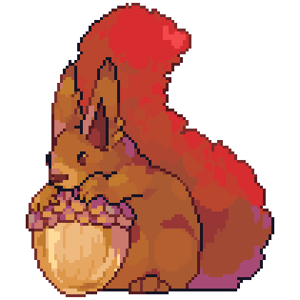

# [](https://deno.land/x/gaming "deno.land/x/gaming")

[](http://deno.land/x/gaming)
[](https://github.com/jeremyBanks/gaming/commits/trunk)
[](https://github.com/jeremyBanks/gaming/actions)
[](https://github.com/jeremyBanks/gaming/pulls)<br>
[](https://stadia.com/)
[](https://xbox.com/)
[](https://www.playstation.com/)
[](https://steampowered.com/)

An Unofficial CLI tool and Deno TypeScript library for interacting with your
Google Stadia account.

**⚠️ Until its 1.0 release, this tool is incomplete and unsupported. Features
may not be implemented, or may not function as described. Come back later. ⚠️**

To use this tool you'll need to install [Deno, a secure runtime for TypeScript
and JavaScript](https://deno.land/). On Linux, you may do so by running:

```
$ curl -fsSL https://deno.land/x/install/install.sh | sh
```

You may run the latest release of this tool directly from Deno's module hosting:

```
$ deno run --allow-all "https://deno.land/x/gaming/stadia.ts"
```

You may install this tool as a local `stadia` command:

```
$ sudo deno install --reload --allow-all --force --root "/usr/local" "https://deno.land/x/gaming/stadia.ts"

$ stadia
```

```
Unofficial Stadia CLI

USAGE:

    stadia [<authentication>] <command> [<arguments>...]

AUTHENTICATION:

    You must authenticate with Google Stadia in one of the following ways:

    (1) If using Google Chrome on Windows 10 and running this command within
        Windows Subsystem for Linux, it will detect any Chrome Profiles that are
        synced with a Google account and load their authentication cookies
        automatically. If there are multiple synced profiles, you will be
        prompted to pick one, or you may specify it with the
        --google-email=<email> parameter.

    (2) The --google-cookie=<cookies> parameter may be set to a header-style
        semicolon-delimited Cookie string that will be used to authenticate with
        Google. This should contain the Google authentication cookies "SID",
        "SSID", and "HSID".

    (3) --offline will disable all authentication and network
        operations. Operations that require data that isn't already saved
        locally will fail.

COMMANDS:

    stadia auth

        Prints information about the authenticated user.

    stadia fetch [--json] <stadia_url>

        Fetches a Stadia URL and displays our internal representation of the
        response. The default output is meant for humans. The [--json] flag
        adds more detail for machines.

        stadia rpc method_id [...json_args]

        stadia captures

```

## Disclaimer

This is an unofficial fan project and is not affiliated with Google. The name
"Stadia" is a trademark of Google LLC, and is used here for informational
purposes, not to imply affiliation or endorsement.

## License

Copyright Jeremy Banks and
[contributors](https://github.com/jeremyBanks/gaming/graphs/contributors).

Licensed under either of

 * [Apache License, Version 2.0](http://www.apache.org/licenses/LICENSE-2.0)
 * [MIT license](http://opensource.org/licenses/MIT)

at your option.

### Contribution

Unless you explicitly state otherwise, any contribution intentionally submitted
for inclusion in the work by you, as defined in the Apache-2.0 license, shall be
dual licensed as above, without any additional terms or conditions.
